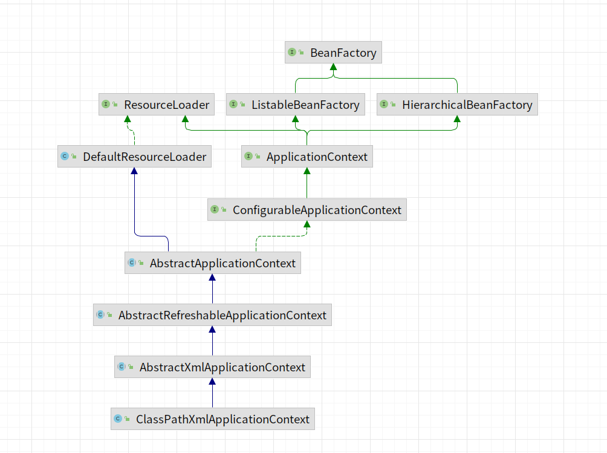

[//]: # (- bean构建流程图)

[//]: # (![bean构建方法]&#40;./assets/pics/bean构建.png&#41;)

- ApplicationContext层次结构图

- 读取xml的`init-method`和`destroy-method`，添加到Beandefinition的定义中
- `AbstractApplicationContext.destroyBeans` bean的销毁和自定义销毁
- `AbstractAutowireCapableBeanFactory.invokeInitMethods` bean的初始化和自定义初始化