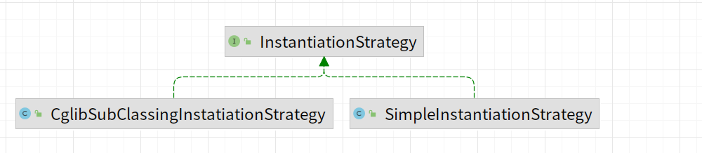

> 分支名称：bean-definition-and-bean-definition-register

主要增加如下类：

- BeanDefinition，顾名思义，用于定义bean信息的类，包含bean的class类型、构造参数、属性值等信息，每个bean对应一个BeanDefinition的实例。简化BeanDefinition仅包含bean的class类型。
- BeanDefinitionRegistry，BeanDefinition注册表接口，定义注册BeanDefinition的方法。
- SingletonBeanRegistry及其实现类DefaultSingletonBeanRegistry，定义添加和获取单例bean的方法。
- BeanFactory, bean工厂接口，包含获取bean方法

bean容器(DefaultListableBeanFactory)作为BeanDefinitionRegistry和SingletonBeanRegistry的实现类，具备两者的能力。向bean容器中注册BeanDefinition后，使用bean时才会实例化。


```java
public class TestBeanFactory {

    @Test
    public void beanDefinitionAndBeanRegisterTest() throws BeanException {
        DefaultListableBeanFactory defaultListableBeanFactory = new DefaultListableBeanFactory();
        BeanDefinition helloWorldBeanDefinition = new BeanDefinition(HelloWorldBean.class);
        defaultListableBeanFactory.registerBeanDefinition("helloWorldBean",helloWorldBeanDefinition);
        HelloWorldBean helloWorldBean = (HelloWorldBean)defaultListableBeanFactory.getBean("helloWorldBean");
        Assert.assertEquals(helloWorldBean.hello(),"HelloWorldBean.hello");
    }

}
```

> 分支名称：instantiation-strategy

bean = beanClass.newInstance(); 仅适用无参构造bean的情况，需要完善实例化策略



主要增加如下类：
抽象出一个bean实例化策略的接口InstantiationStrategy，有两个实现类
- SimpleInstantiationStrategy，通过构造函数的方式进行实例化
- CglibSubClassingInstatiationStrategy，通过Cglib动态代理实现子类

> 分支名称：decorate-bean-with-property-values 

BeanDefinition 中添加对应bean属性的PropertyValues 成员变量
PropertyValue 包括 name和value 两个属性
```java
public class BeanWithPropertyValuesTest {

    @Test
    public void testBeanWithPropertyValues() throws BeanException {
        DefaultListableBeanFactory beanFactory = new DefaultListableBeanFactory();
        PropertyValues propertyValues = new PropertyValues();
        propertyValues.addPropertyValue(new PropertyValue("name","helloWorld"));
        propertyValues.addPropertyValue(new PropertyValue("age",18));
        BeanDefinition beanDefinition = new BeanDefinition(Person.class,propertyValues);
        beanFactory.registerBeanDefinition("person",beanDefinition);
        Person person = (Person)beanFactory.getBean("person");
        Assertions.assertNotNull(person);
        Assertions.assertEquals(person.getAge(),18);
        Assertions.assertEquals(person.getName(),"helloWorld");
    }
}

```


